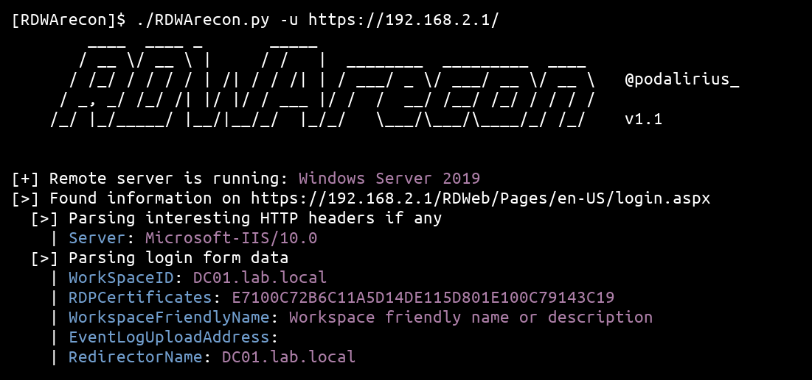

<p align="center">
  A python script to extract information from a Microsoft Remote Desktop Web Access (RDWA) application
  <br>
  
  <a href="https://twitter.com/intent/follow?screen_name=podalirius_" title="Follow"></a>
  <a href="https://www.youtube.com/c/Podalirius_?sub_confirmation=1" title="Subscribe"></a>
  <br>
</p>

This python script allow to extract various information from a Microsoft Remote Desktop Web Access (RDWA) application, such as the FQDN of the remote server, the internal AD domain name (from the FQDN), and the remote Windows Server version

## Usage

```
$ ./RDWArecon.py -h
        ____  ____ _       _____                             
       / __ \/ __ \ |     / /   |  ________  _________  ____ 
      / /_/ / / / / | /| / / /| | / ___/ _ \/ ___/ __ \/ __ \   @podalirius_
     / _, _/ /_/ /| |/ |/ / ___ |/ /  /  __/ /__/ /_/ / / / /   
    /_/ |_/_____/ |__/|__/_/  |_/_/   \___/\___/\____/_/ /_/    v1.2
                                                             
    
usage: RDWArecon.py [-h] [-f FILE] -u URL [-v] [-k] [-L] [--no-colors]

Extract information about the server and the domain from external RDWeb pages.

options:
  -h, --help            show this help message and exit
  -v, --verbose         Verbose mode. (default: False)
  -k, --insecure        Allow insecure server connections when using SSL (default: False)
  -L, --location        Follow redirects (default: False)
  --no-colors           Disable colored output (default: False)

Targets:
  -f FILE, --file FILE  Path to file containing a line by line list of targets.
  -u URL, --url URL     Target url.
```

## How it works

### Getting information about the remote server

There is many pre-filled information on the `login.aspx` page of the Remote Desktop Web Access (RDWA) application. In the input fields `WorkSpaceID` and/or `RedirectorName` we can find the FQDN of the remote server, and `WorkspaceFriendlyName` can contain a text description of the workspace. 

```html
<form id="FrmLogin" name="FrmLogin" action="login.aspx?ReturnUrl=%2FRDWeb%2FPages%2Fen-US%2FDefault.aspx" method="post" onsubmit="return onLoginFormSubmit()">
    <input type="hidden" name="WorkSpaceID" value="DC01.lab.local"/>
    <input type="hidden" name="RDPCertificates" value="E7100C72B6C11A5D14DE115D801E100C79143C19"/>
    <input type="hidden" name="PublicModeTimeout" value="20"/>
    <input type="hidden" name="PrivateModeTimeout" value="240"/>
    <input type="hidden" name="WorkspaceFriendlyName" value="Workspace%20friendly%20name%20or%20description"/>
    <input type="hidden" name="EventLogUploadAddress" value=""/>
    <input type="hidden" name="RedirectorName" value="DC01.lab.local"/>
    <input type="hidden" name="ClaimsHint" value=""/>
    <input type="hidden" name="ClaimsToken" value=""/>
    
    <input name="isUtf8" type="hidden" value="1"/>
    <input type="hidden" name="flags" value="0"/>
...
</form>
```

The [RDWArecon.py](./RDWArecon.py) tool automatically parses this form and extract all the information.

### OS version banner image

If the remote RDWeb installation was not hardened, there is a high chance that the default version image file `/RDWeb/Pages/images/WS_h_c.png` is still accessible (even if not mentioned on the login page). This is really awesome as we can compare its sha256 hash value directly with a known table of the windows banners of this service:

| Windows OS                 | SHA256 hash                                                        | Banner                                                            |
|----------------------------|--------------------------------------------------------------------|-------------------------------------------------------------------|
| **Windows Server 2008 R2** | `5a8a77dc7ffd463647987c0de6df2c870f42819ec03bbd02a3ea9601e2ed8a4b` |             | 
| **Windows Server 2012 R2** | `4560591682d433c7fa190c6bf40827110e219929932dc6dc049697529c8a98bc` |       | 
| **Windows Server 2012 R2** | `3d9b56811a5126a6d3b78a692c2278d588d495ee215173f752ce4cbf8102921c` |       | 
| **Windows Server 2016**    | `fb1505aadeab42d82100c4d23d421f421c858feae98332c55a4b9595f4cea541` |   | 
| **Windows Server 2016**    | `3dbbeff5a0def7e0ba8ea383e5059eaa6acc37f7f8857218d44274fc029cfc4b` |            | 
| **Windows Server 2019**    | `2da4eb15fda2b7c80a94b9b2c5a3e104e2a9a2d9e9b3a222f5526c748fadf792` |            | 
| **Windows Server 2022**    | `256a6445e032875e611457374f08acb0565796c950eb9c254495d559600c0367` |            | 

The [RDWArecon.py](./RDWArecon.py) tool automatically gets this file and compare its hash to get the remote Windows Server version.

## Demonstration

https://user-images.githubusercontent.com/79218792/152828736-e2e39305-8167-432e-ac3a-3449ea9ff414.mp4

## Example of output



## Contributing

Pull requests are welcome. Feel free to open an issue if you want to add other features.

## References
 - https://twitter.com/podalirius_/status/1490734021332160525
